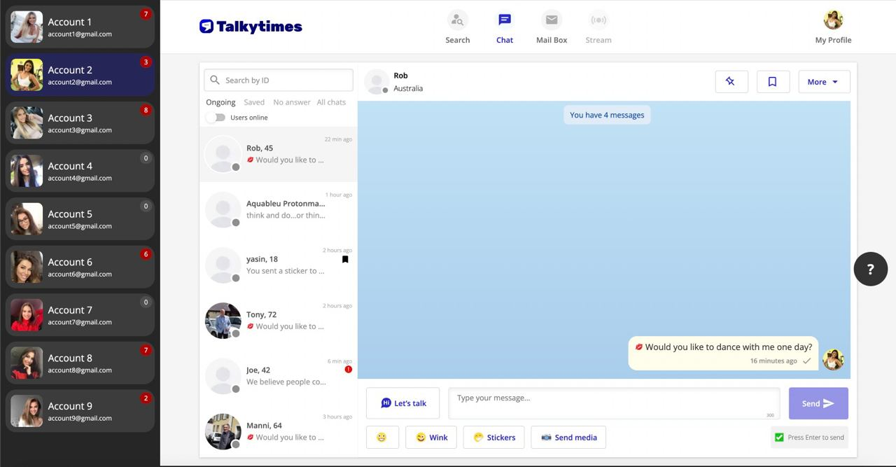

# Talkytimes multi-account Chrome extension

Advanced multi-account Chrome extension for [talkytimes.com](https://talkytimes.com) site with authorization and server-side API for collect accounts data.



## License
For non-commercial use only.
If you want to buy source code and ownership you can contact me on Telegram: [@serdnaley](https://t.me/serdnaley)

## Usage

### 1. Install dependencies
```bash
cd server
yarn install
```

### 2. Fill accounts
Example file: `users.example.json`. Copy it to `users.json` and fill out tokens and credentials. Tokens will be used for operators authentication.

### 3. Run server
```bash
cd server
yarn start
``` 
Or if you want to run it in background:
```bash
cd server
pm2 start npm --name "talkytimes-extension-server" -- start
```

### 4. Add extension
- Open Chrome and go to [chrome://extensions/](chrome://extensions/).
- Click `Add`.
- Click `Load unpacked extension...`.
- Select `extension` folder on this repository.

### 5. Authorize extension
- Open [talkytimes.com](https://talkytimes.com).
- Click extension icon on the top right side of Chrome.
- Enter your access token from users.json.
- Click `Authorize`.

### 6. Enjoy :)
